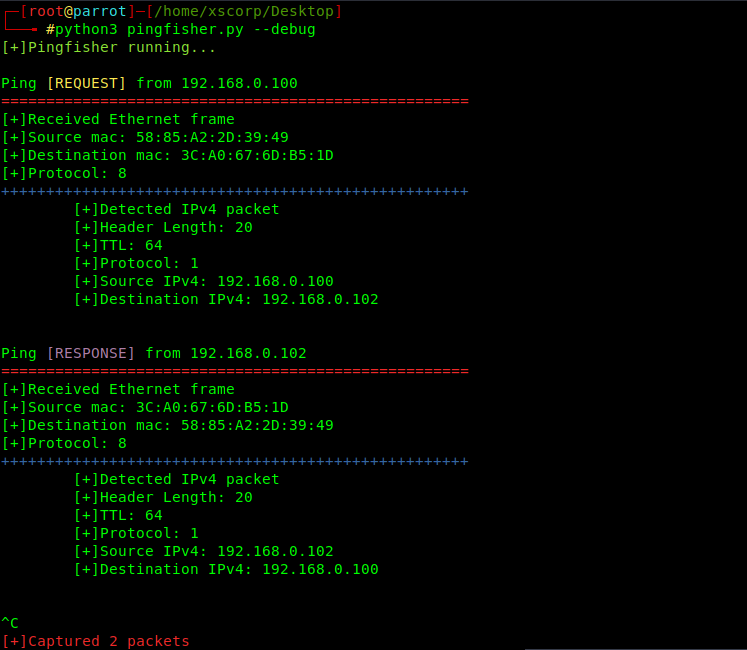

# pingfisher


Pingfisher is a tool to capture ICMPv4 and ICMPv6 ping requests and reply.

## Why pingfisher?
I mainly made it for the purpose of assistence in CTFs. Suppose you have a blind RCE exploit code which accepts commands from you and executes them on target system but doesn't produces any output. To check if it's actually working, probably the easiest method is to ping your system from the remote system through the exploit and capture the ICMP packets in your system through any linux utility like **tcpdump** or **wireshark**.
I found that sometimes, **tcpdump** was unable to capture ping requests(don't know why). Also, the representation of it's output is not that friendly. Additionally, you need to specify interface to listen on in tcpdump and in some distributions, it's not installed by default. It can also be done with wireshark, but there could be times when you don't have access to GUI. So I decided to create a tool that captures ICMP requests in both IPv4 and IPv6 packets that never fails and is easy to use.

## How does it work?
It works by creating a raw socket and listening for ethernet frames on the network. Upon receiving them, it unpacks the ethernet frame and checks if the payload inside it is an IPv4 or IPv6 packet. If it's an IPv4 or IPv6 packet, it further unpacks it and checks whether the payload contained in it is an ICMPv4 or ICMPv6 packet. If it is an ICMP packet, it further unpacks it and checks whether it is an ICMP request or ICMP reply.

## Command arguments
```--debug``` , ```-d```: The debug option is for verbose output. Using this option will show the frame and packet data of every ICMP request/response.

## Usage:
* Clone the repository:

```git clone https://github.com/xscorp/pingfisher.git```

* Execute pingfisher.py:

```python3 pingfisher.py```

And now you can ping your system from anywhere and it will present you with output as shown below.

## Screenshots
* ### On normal run


* ### With debug option set


## Problem with localhost
Yes, I too faced it. On sending one ping request, it's showing two ICMP requests and hence sending two responses. I have no idea why this is happening with localhost IP. The loopback interface might have different inner workings. Please let me know if you have any explaination for that.

### Created by xscorp
Twitter: [@xscorp7](https://twitter.com/xscorp7 "xscorp7 on Twitter")

Github: [@xscorp](https://github.com/xscorp "xscorp on Github")
